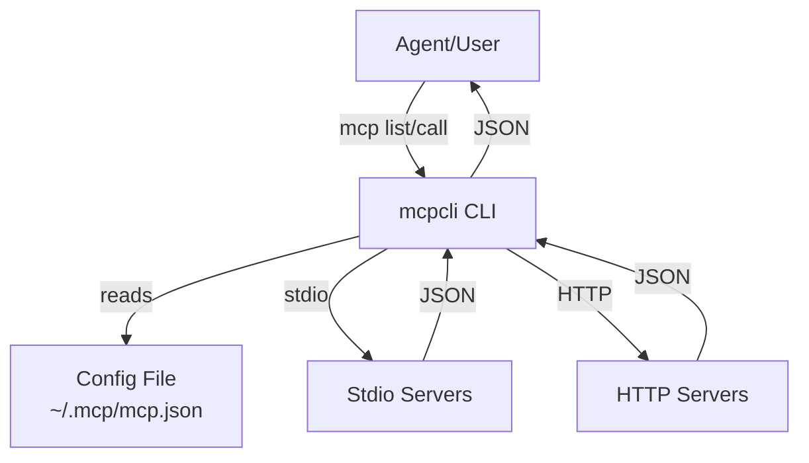
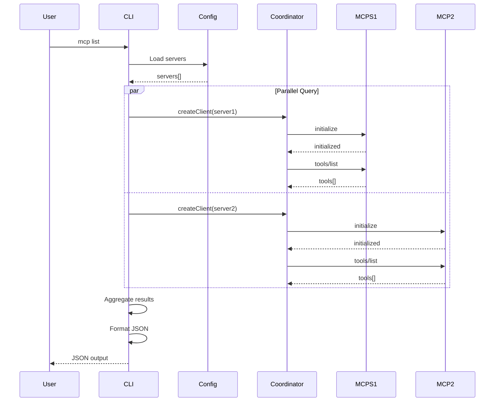
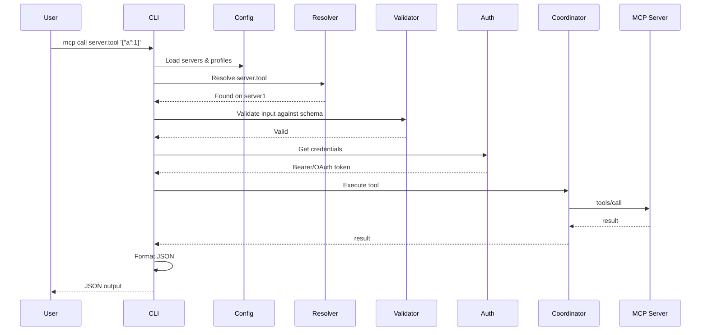

# Architecture

Complete architecture guide for `mcpcli` using the arc42 model.

## 1. Introduction & Goals

### Business Goals

1. **Enable agent tool access** - Provide LLM agents with a simple way to discover and execute MCP tools
2. **Reduce integration complexity** - No Docker, SDKs, or background processes needed
3. **Support multiple transports** - Work with both local (stdio) and remote (HTTP) servers
4. **Agent-first design** - Deterministic JSON output, perfect for machine parsing

### Quality Goals

| Goal              | Importance | Description                              |
| ----------------- | ---------- | ---------------------------------------- |
| **Reliability**   | ⭐⭐⭐⭐⭐ | Must work consistently, fail gracefully  |
| **Performance**   | ⭐⭐⭐⭐   | Parallel discovery, minimal overhead     |
| **Statelessness** | ⭐⭐⭐⭐⭐ | Each command independent, no persistence |
| **Security**      | ⭐⭐⭐⭐⭐ | Env vars for secrets, HTTPS for remote   |
| **Simplicity**    | ⭐⭐⭐⭐   | Easy to understand and use               |

## 2. Constraints

### Technical Constraints

- **Node.js ≥18** - Runtime requirement
- **CLI-based** - No API server, stateless invocation
- **JSON I/O** - All communication via JSON
- **HTTPS only** - HTTP servers must use HTTPS
- **Stdio compatibility** - Must work with any MCP compatible stdio server

### Organizational Constraints

- **Single tool** - One CLI binary, no plugins/extensions in v0.1
- **Public release** - Must be suitable for npm registry
- **Open source** - MIT license, community contributions accepted

### Deployment Constraints

- **No background service** - Each command is a clean invocation
- **No database** - No persistent state storage
- **No dependencies on external services** - Must work offline with local servers

## 3. Context & Scope

### Business Context

```
Actors:
  - LLM Agents (end users)
  - Developers (maintainers)
  - MCP Server Providers (tool creators)

Dependencies:
  - MCP Servers (provides tools)
  - npm Registry (distribution)
  - Node.js Runtime (execution)
```

### Technical Context

```
External Systems:
  - MCP Servers (stdio or HTTP)
  - Auth Systems (OAuth providers)
  - File System (config files)
  - Environment (variables)
```

**Interaction Flow:**

```
Agent/Human
    ↓
mcpcli CLI ← Config (~/.mcp/mcp.json)
    ↓
MCP Servers (stdio/HTTP)
    ↓
Tools (discovered & executed)
    ↓
Results (JSON output)
```

## 4. Solution Strategy

### Fundamental Decisions

1. **Stateless per invocation**
   - Each call is independent
   - No persistence between calls
   - No background process
   - Maximum reliability and simplicity

2. **Configuration-driven**
   - All servers defined in one file
   - Environment variable substitution
   - Profile support for scenarios
   - No command-line server registration

3. **Parallel discovery**
   - All servers queried simultaneously
   - Single bottleneck is slowest server
   - Graceful handling of partial failures
   - Fast aggregation

4. **Explicit over implicit**
   - Tool namespacing required (server.tool)
   - Clear error messages
   - No magic or assumptions
   - Predictable behavior

### Patterns Used

- **Factory Pattern** - Auth provider selection
- **Registry Pattern** - Tool discovery and resolution
- **Coordinator Pattern** - MCP client lifecycle
- **Strategy Pattern** - Multiple transport types (stdio/HTTP)

## 5. Building Block View

### Level 1: System Context



### Level 2: Component Decomposition

```
mcpcli/
├── CLI Layer (commands & parsing)
    ├── list.ts - Tool discovery command
    ├── call.ts - Tool execution command
    └── cli.ts - Main entry point
├── Handler Layer (request processing)
    ├── discovery.ts - Parallel server queries
    └── execution.ts - Tool resolution & execution
├── Gateway Layer (MCP client management)
    ├── coordinator.ts - Client lifecycle
    └── tool-registry.ts - Namespace management
├── Config Layer (loading & validation)
    ├── loader.ts - File I/O
    ├── schema.ts - Zod validation
    └── types.ts - TypeScript interfaces
├── Auth Layer (credential management)
    ├── bearer-provider.ts - Static tokens
    ├── oauth-provider.ts - OAuth 2.0 flow
    └── auth-factory.ts - Provider selection
├── Error Layer (error handling)
    ├── custom-errors.ts - Error classes
    └── error-formatter.ts - JSON formatting
└── Output Layer (formatting)
    ├── formatters.ts - JSON output
    └── retry.ts - Retry logic
```

### Level 2: Data Flow

```
User Input (CLI args & env vars)
    ↓
[CLI Parser]
    ↓ command + options
[Config Loader]
    ↓ servers + profiles
[Command Handler] (list or call)
    ↓
    ├─→ [Discovery Handler]
    │   ├─→ [Auth Provider] (if needed)
    │   └─→ [Coordinator] (create MCP clients)
    │   └─→ [Transport] (stdio/HTTP)
    │   └─→ [Tool Registry] (aggregate)
    │
    └─→ [Execution Handler]
        ├─→ [Tool Resolver] (find tool)
        ├─→ [Validator] (check input)
        ├─→ [Auth Provider] (if needed)
        └─→ [Coordinator] (execute)
            ↓
[Error Formatter or Output Formatter]
    ↓
JSON to stdout
```

## 6. Runtime View

### Tool Discovery Sequence



### Tool Execution Sequence



## 7. Deployment View

### Local Development

```
Developer Machine
├── Node.js 18+
├── mcpcli (installed via npm)
├── ~/.mcp/mcp.json
└── MCP Servers (local stdio processes)
```

### Production Agent

```
Agent Runtime (e.g., LLM framework)
├── mcpcli (installed via npm)
├── Environment: (secret env vars)
├── /etc/.mcp/mcp.json (config file)
└── MCP Servers (stdio or HTTP)
```

### Docker Container

```
Container
├── Node.js base image
├── mcpcli npm install
├── mcpcli config mounted
└── Server endpoints (external URLs)
```

## 8. Cross-Cutting Concepts

### Error Handling

**Principle:** Fail gracefully, report clearly

1. **Validation errors** → 400 (invalid_input)
2. **Connection errors** → 503 (connection)
3. **Tool not found** → 404 (tool_not_found)
4. **Execution errors** → 500 (execution)
5. **Config errors** → 400 (config)

All errors return structured JSON with helpful context.

### Authentication

**Principle:** Flexible, secure by default

- **Bearer tokens** - Simple, static auth
- **OAuth 2.0** - Enterprise, automatic refresh
- **Environment variables** - Never hardcode secrets
- **HTTPS only** - For remote servers

### Logging

**Principle:** Debug without noise

- **stderr** - Debug logs (only with --verbose)
- **stdout** - Clean JSON output
- **Timestamps** - When --verbose enabled
- **Structured** - JSON format for parsing

### Security

**Principle:** Secure by default

- ✅ Env vars for secrets (not hardcoded)
- ✅ HTTPS for remote servers
- ✅ Stdio isolation (local processes)
- ✅ No data persistence (nothing to leak)
- ✅ Validate all inputs
- ✅ Clear error messages (no info leakage)

## 9. Architecture Decisions (ADRs)

### ADR 001: Stateless Architecture

**Decision:** Each mcpcli invocation is independent with no persistent state.

**Rationale:**

- Simple and reliable (no state corruption)
- Safe for concurrent use
- Perfect for agents/scripts
- No background process needed
- Easy to test and debug

**Consequences:**

- Re-connections on every call (slight overhead)
- No in-process caching (queries fresh data)
- Must reload config each time
- Better for security (no state leaks)

### ADR 002: Configuration File Over CLI Args

**Decision:** All server configuration in ~/.mcp/mcp.json (not CLI flags).

**Rationale:**

- One source of truth
- Easy to version control
- Profile support (dev/prod)
- Environment variable substitution
- Scales better than CLI args

**Consequences:**

- Users must maintain config file
- Config file as public API
- Must validate config strictly
- Support for JSON and YAML formats

### ADR 003: Parallel Server Discovery

**Decision:** Query all servers in parallel, not sequentially.

**Rationale:**

- Fast discovery (N servers = ~1 server time)
- Better UX (no waiting for slowest)
- Independent servers (one failure doesn't block others)
- Modern runtime (Node.js handles async well)

**Consequences:**

- Slightly more complex code
- Resource usage spike
- Memory overhead (connections hold state)
- Need timeout management

### ADR 004: Explicit Tool Namespacing

**Decision:** Tools must be accessed as `server_name.tool_name`, not just `tool_name`.

**Rationale:**

- Clear which server provides tool
- Prevents conflicts between servers
- Explicit beat implicit
- Easy for agents to parse

**Consequences:**

- Longer tool names
- Must know server name
- More verbose commands
- Safer (no ambiguity)

## 10. Quality Metrics

### Reliability

- **Availability:** Should work consistently with functioning servers
- **Recovery:** Graceful degradation on partial failures
- **Correctness:** Exact tool execution (no data transformation)

### Performance

- **Discovery:** <5s for 10 servers with 100 tools each
- **Execution:** <500ms overhead per call
- **Parallel discovery:** Near-O(1) with respect to server count

### Maintainability

- **Code metrics:**
  - Modular structure (7 layers)
  - ~1,100 lines of core code
  - <40 lines average function length
  - High test coverage (>80% target)

### Security

- **No hardcoded secrets**
- **HTTPS required for remotes**
- **Validated inputs**
- **Structured error responses**

## Next Steps

- 📖 **[Design Philosophy](design-philosophy.md)** — Why decisions were made
- 🔐 **[Authentication Flows](auth-flows.md)** — How auth works
- 🏷️ **[Tool Namespacing](tool-namespacing.md)** — Namespace design
