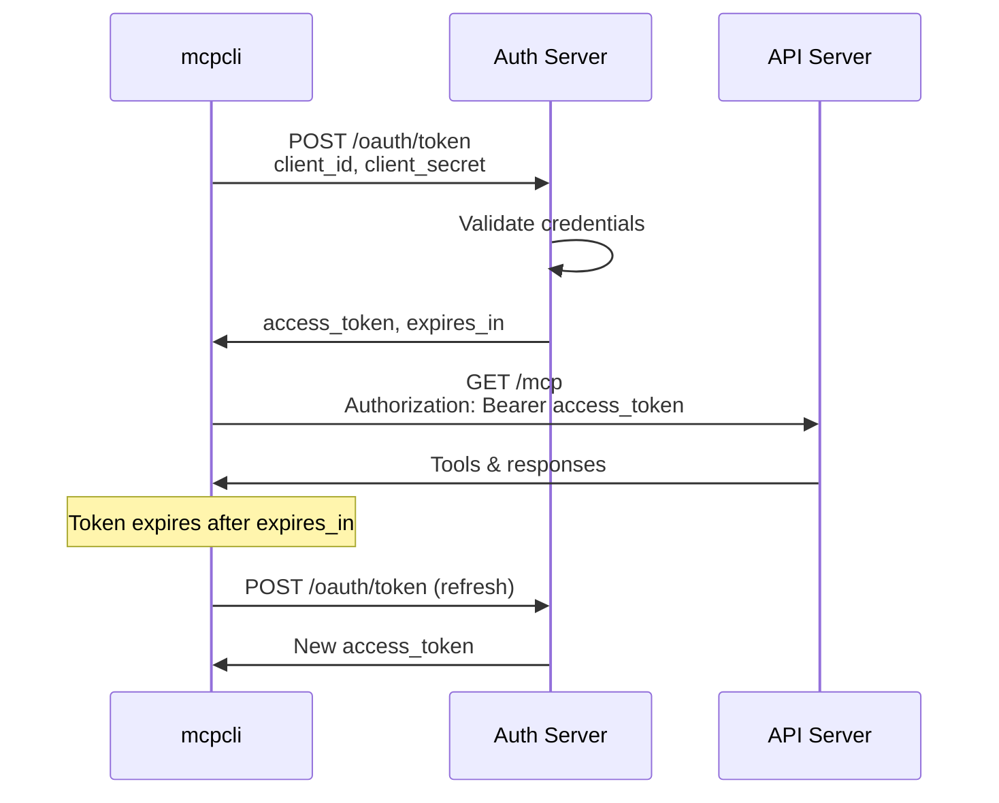

# OAuth 2.0 Authentication

Configure OAuth 2.0 client credentials flow for MCP servers.

## When to Use OAuth 2.0

Use OAuth when:

- Your **tokens expire** and need automatic refresh
- You have **client ID and secret**
- Your API follows **OAuth 2.0 client credentials flow**
- You want **automatic token management**

For static tokens that don't expire, use **[Bearer Tokens](auth-bearer.md)** instead.

## Quick Start

Add an `auth` section with OAuth configuration:

```json
{
  "servers": [
    {
      "name": "oauth_api",
      "type": "http",
      "url": "https://api.example.com/mcp",
      "auth": {
        "type": "oauth",
        "clientId": "client_id_123",
        "clientSecret": "client_secret_abc",
        "tokenUrl": "https://auth.example.com/oauth/token"
      }
    }
  ]
}
```

mcpcli will:

1. Obtain a token using client credentials
2. Use the token for API requests
3. Automatically refresh when token expires

## Using Environment Variables

**Never hardcode credentials.** Use environment variables:

```json
{
  "servers": [
    {
      "name": "secure_oauth_api",
      "type": "http",
      "url": "https://api.example.com/mcp",
      "auth": {
        "type": "oauth",
        "clientId": "${OAUTH_CLIENT_ID}",
        "clientSecret": "${OAUTH_CLIENT_SECRET}",
        "tokenUrl": "${OAUTH_TOKEN_URL}"
      }
    }
  ]
}
```

Set environment variables:

```bash
# Linux/macOS
export OAUTH_CLIENT_ID="client_id_123"
export OAUTH_CLIENT_SECRET="client_secret_abc"
export OAUTH_TOKEN_URL="https://auth.example.com/oauth/token"
mcp list

# Windows PowerShell
$env:OAUTH_CLIENT_ID = "client_id_123"
$env:OAUTH_CLIENT_SECRET = "client_secret_abc"
$env:OAUTH_TOKEN_URL = "https://auth.example.com/oauth/token"
mcp list
```

## OAuth Flow Explanation



## Complete Example

Production-ready OAuth configuration:

```json
{
  "version": "1.0.0",
  "servers": [
    {
      "name": "company_api",
      "type": "http",
      "url": "https://api.company.com/mcp",
      "auth": {
        "type": "oauth",
        "clientId": "${OAUTH_CLIENT_ID}",
        "clientSecret": "${OAUTH_CLIENT_SECRET}",
        "tokenUrl": "https://auth.company.com/oauth/token",
        "scope": "mcp:read mcp:write"
      },
      "timeout": 30000
    }
  ],
  "profiles": {
    "production": {
      "servers": ["company_api"]
    }
  }
}
```

**Environment variables (.env):**

```
OAUTH_CLIENT_ID=client_abc_123_xyz
OAUTH_CLIENT_SECRET=secret_def_456_uvw
```

## Configuration Fields

| Field          | Required | Description                    |
| -------------- | -------- | ------------------------------ |
| `type`         | ✅       | Must be `"oauth"`              |
| `clientId`     | ✅       | OAuth client ID                |
| `clientSecret` | ✅       | OAuth client secret            |
| `tokenUrl`     | ✅       | Token endpoint URL             |
| `scope`        | ❌       | OAuth scopes (space-separated) |
| `audience`     | ❌       | API audience identifier        |

### Optional: Scopes

Request specific scopes:

```json
{
  "auth": {
    "type": "oauth",
    "clientId": "${CLIENT_ID}",
    "clientSecret": "${CLIENT_SECRET}",
    "tokenUrl": "https://auth.example.com/oauth/token",
    "scope": "mcp:discover mcp:execute mcp:admin"
  }
}
```

### Optional: Audience

For APIs using audience-restricted tokens:

```json
{
  "auth": {
    "type": "oauth",
    "clientId": "${CLIENT_ID}",
    "clientSecret": "${CLIENT_SECRET}",
    "tokenUrl": "https://auth.example.com/oauth/token",
    "audience": "https://api.example.com"
  }
}
```

## Token Refresh

mcpcli automatically manages token refresh:

1. **Initial request:** Obtains token from auth server
2. **Token stored:** Kept in memory for duration of process
3. **Expiration:** Checks when token is 90% through its lifetime
4. **Refresh:** Obtains new token before expiry
5. **Retry:** Retries failed request with new token

**Example token lifetime:**

- Obtained token with 1-hour expiry (3600 seconds)
- At 54 minutes: Token refresh triggered
- New token obtained: Remains valid for another hour
- No service interruption

## Multiple OAuth Servers

```json
{
  "servers": [
    {
      "name": "internal_api",
      "type": "http",
      "url": "https://internal.company.com/mcp",
      "auth": {
        "type": "oauth",
        "clientId": "${INTERNAL_CLIENT_ID}",
        "clientSecret": "${INTERNAL_CLIENT_SECRET}",
        "tokenUrl": "https://auth.company.com/oauth/token"
      }
    },
    {
      "name": "partner_api",
      "type": "http",
      "url": "https://partners.example.com/mcp",
      "auth": {
        "type": "oauth",
        "clientId": "${PARTNER_CLIENT_ID}",
        "clientSecret": "${PARTNER_CLIENT_SECRET}",
        "tokenUrl": "https://auth.partner.com/oauth/token"
      }
    }
  ]
}
```

Set different credentials:

```bash
export INTERNAL_CLIENT_ID="internal_id"
export INTERNAL_CLIENT_SECRET="internal_secret"
export PARTNER_CLIENT_ID="partner_id"
export PARTNER_CLIENT_SECRET="partner_secret"
mcp list
```

## Testing OAuth Configuration

Verify your OAuth setup works:

```bash
$ mcp list --verbose
```

Debug output shows token exchange:

```
[2026-04-11T10:30:45.123Z] DEBUG: OAuth token exchange...
[2026-04-11T10:30:45.234Z] DEBUG: Obtained token, expires in 3600s
[2026-04-11T10:30:45.345Z] DEBUG: Successfully connected via OAuth
[2026-04-11T10:30:45.456Z] INFO: Discovery complete
```

If OAuth fails:

```json
{
  "success": false,
  "error": {
    "type": "connection",
    "message": "OAuth authentication failed",
    "details": {
      "reason": "Invalid client credentials"
    }
  }
}
```

## Common Issues

### "Invalid client credentials"

**Problem:** Authentication fails with invalid credentials error.

**Solution:**

1. Verify `clientId` is correct
2. Verify `clientSecret` is correct
3. Verify credentials haven't expired
4. Check API documentation for client credential requirements

### "Token URL unreachable"

**Problem:** Can't connect to token endpoint.

**Solution:**

1. Verify `tokenUrl` is correct and accessible
2. Check network/firewall allows HTTPS to token server
3. Verify token server is running
4. Try accessing URL directly: `curl https://auth.example.com/oauth/token`

### "Scope not granted"

**Problem:** Token obtained but missing required permissions.

**Solution:**

- Request additional scopes in config:
  ```json
  "scope": "mcp:discover mcp:execute mcp:admin"
  ```
- Register your application with new scopes
- Re-authenticate after updating scopes

### "Credentials exposed"

**Problem:** Credentials visible in logs or version control.

**Solution:**

1. Rotate credentials immediately
2. Update environment variables
3. Check git history: `git log -p | grep -i secret`
4. Use `.gitignore` to prevent future leaks

## Security Best Practices

1. ✅ **Always use environment variables**

   ```json
   "clientSecret": "${OAUTH_CLIENT_SECRET}"
   ```

2. ✅ **Use HTTPS for all endpoints**

   ```json
   "url": "https://..."
   "tokenUrl": "https://..."
   ```

3. ✅ **Rotate credentials regularly**
   - Quarterly rotation recommended
   - Update environment variables
   - Monitor usage

4. ✅ **Add config to `.gitignore`**

   ```
   ~/.mcp/mcp.json
   .env
   *.key
   ```

5. ✅ **Use minimal scopes**
   - Request only necessary permissions
   - Example: `"mcp:discover"` not `"*"`

6. ✅ **Use audience restriction**

   ```json
   "audience": "https://api.example.com"
   ```

7. ❌ **Never:**
   - Commit credentials to git
   - Share credentials via email/chat
   - Use same credentials for dev/prod
   - Log sensitive values

## Debugging

Enable verbose logging to see OAuth flow:

```bash
$ mcp call my_tool '{}' --verbose

# stderr output shows:
# [DEBUG] OAuth token exchange...
# [DEBUG] Obtained token, expires in 3600s
# [DEBUG] Request with token: Bearer eyJ...
```

## Getting Client Credentials

Different providers have different processes:

=== "Auth0"

    1. Go to Applications → Create Application
    2. Select Machine-to-Machine
    3. Select your API
    4. Authorize client
    5. Copy Client ID and Client Secret

=== "Azure AD"

    1. Azure Portal → App registrations
    2. New registration
    3. Certificates & secrets
    4. New client secret
    5. Copy Application (client) ID and secret value

=== "Google Cloud"

    1. Google Cloud Console
    2. Create service account
    3. Create key (JSON)
    4. Extract client_email and private_key

=== "GitHub"

    1. Settings → Developer settings → OAuth Apps
    2. Create New OAuth App
    3. Copy Client ID and Client Secret

## Next Steps

- 🔑 **[Bearer Tokens](auth-bearer.md)** — For static tokens
- 🔧 **[Configuration](configuration.md)** — More config options
- 📖 **[CLI Reference](../reference/cli-commands.md)** — All commands
