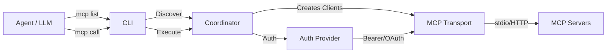

# Welcome to mcpcli

A lightweight, stateless CLI gateway client for the **Model Context Protocol (MCP)** — enabling agents to discover and execute MCP tools without Docker, SDK integration, or background processes.

## Why mcpcli?

### The Problem

- **LLM agents** need access to external tools
- Existing solutions require Docker, persistent servers, or deep SDK integration
- Setting up MCP servers shouldn't be complex

### The Solution

`mcpcli` provides a **thin, stateless gateway** that:

- ✅ Discovers tools across multiple MCP servers with a single command
- ✅ Executes tools with JSON input/output
- ✅ Supports multiple authentication methods (Bearer tokens, OAuth 2.0)
- ✅ Works with stdio and HTTP MCP servers
- ✅ Runs on every machine—no background process needed
- ✅ Agent-ready: deterministic JSON output, perfect for LLMs

## Key Features

### 🔍 **Tool Discovery**

Discover all available tools from your configured MCP servers:

```bash
mcp list
```

### ⚙️ **Tool Execution**

Execute any tool with JSON parameters:

```bash
mcp call my_tool '{"param": "value"}'
```

### 🔐 **Multiple Auth Methods**

- Static bearer tokens
- OAuth 2.0 client credentials
- Environment variable substitution

### 🌐 **Multi-Transport**

- **Stdio:** Local MCP servers
- **HTTP:** Remote MCP servers

### 📦 **Configuration Flexibility**

- JSON and YAML support
- Profile-based server grouping (dev/prod)
- Environment variable interpolation

## Quick Start

### 1. Install

```bash
npm install -g mcpcli
```

### 2. Configure

Create `~/.mcp/mcp.json`:

```json
{
  "version": "1.0.0",
  "servers": [
    {
      "name": "my_mcp",
      "type": "stdio",
      "command": "node",
      "args": ["/path/to/server.js"]
    }
  ]
}
```

### 3. Discover Tools

```bash
$ mcp list
{
  "success": true,
  "servers": {
    "my_mcp": {
      "status": "connected",
      "tools": [
        {
          "name": "read_file",
          "description": "Read file contents"
        }
      ]
    }
  },
  "aggregated": {
    "total": 1,
    "tools": [...
  ]
}
```

### 4. Execute a Tool

```bash
$ mcp call my_mcp.read_file '{"path":"/etc/hosts"}'
{
  "success": true,
  "result": "127.0.0.1 localhost\n..."
}
```

## Documentation Structure

- **[Getting Started](getting-started/quick-start.md)** — Installation and first steps
- **[Tutorials](tutorials/first-discovery.md)** — Guided step-by-step lessons
- **[How-to Guides](guides/configuration.md)** — Solutions to specific problems
- **[Reference](reference/cli-commands.md)** — Complete API and CLI reference
- **[Architecture](explanation/architecture.md)** — How mcpcli works internally

## Architecture Overview



## Installation Options

=== "Global (Recommended)"

    ```bash
    npm install -g mcpcli
    mcp list
    ```

=== "Local Project"

    ```bash
    npm install --save-dev mcpcli
    npx mcp list
    ```

=== "With npx (No Install)"

    ```bash
    npx mcpcli list
    ```

## What's Next?

- 👉 **New to mcpcli?** Start with the [Quick Start Guide](getting-started/quick-start.md)
- 🔧 **Setting up servers?** See [Configuration Guide](guides/configuration.md)
- 🔐 **Adding authentication?** Check [Authentication](guides/auth-bearer.md)
- 🏗️ **Learn how it works?** Read [Architecture](explanation/architecture.md)

## Community

- **GitHub Issues:** [Report a bug](https://github.com/yourusername/mcp-cli/issues)
- **Discussions:** [Ask for help](https://github.com/yourusername/mcp-cli/discussions)
- **Contributing:** [Submit a PR](contributing/index.md)

## License

MIT License — See LICENSE for details.
