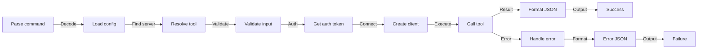

# API & Tool Discovery Reference

Technical reference for tool discovery and MCP protocol integration.

## Discovery Process

When you run `mcp list`, mcpcli performs these steps:


## Tool Object Structure

Each tool has this structure:

```json
{
  "name": "tool_name",
  "description": "What this tool does",
  "inputSchema": {
    "type": "object",
    "properties": {
      "param1": {
        "type": "string",
        "description": "Parameter description"
      },
      "param2": {
        "type": "number"
      }
    },
    "required": ["param1"]
  }
}
```

## Tool Namespacing

Tools are namespaced by server name:

**Per-Server:**

```json
{
  "name": "read_file",
  "description": "..."
}
```

**Aggregated (with namespace):**

```json
{
  "name": "database.read_file",
  "server": "database",
  "description": "..."
}
```

**Why?** Prevents conflicts when multiple servers have the same tool.

Example:

- `database.query` — From database server
- `api.query` — From API server
- Both can exist without conflict

## Discovery Output Structure

Complete structure of `mcp list` output:

```json
{
  "success": true|false,

  "servers": {
    "server_name": {
      "status": "connected|failed",
      "tools": [
        {
          "name": "tool_name",
          "description": "...",
          "inputSchema": { /* JSON Schema */ }
        }
      ],
      "error": null|{...}
    }
  },

  "aggregated": {
    "total": 5,
    "tools": [
      {
        "name": "server_name.tool_name",
        "server": "server_name",
        "description": "..."
      }
    ]
  }
}
```

### Per-Server Details

Each server in `servers` object:

| Field    | Type   | Description                        |
| -------- | ------ | ---------------------------------- |
| `status` | string | `"connected"` or `"failed"`        |
| `tools`  | array  | Array of tool objects              |
| `error`  | object | Only present if status is "failed" |

### Aggregated View

The `aggregated` object provides an overview:

| Field   | Type   | Description                                 |
| ------- | ------ | ------------------------------------------- |
| `total` | number | Total tools across all servers              |
| `tools` | array  | Flattened list of all tools with namespaces |

## Tool Schema (JSON Schema)

Tools define input parameters using JSON Schema format:

### Simple Parameters

```json
{
  "type": "object",
  "properties": {
    "name": {
      "type": "string",
      "description": "User's name"
    },
    "age": {
      "type": "number",
      "description": "User's age"
    },
    "active": {
      "type": "boolean",
      "description": "Is user active?"
    }
  },
  "required": ["name"]
}
```

### Complex Parameters

```json
{
  "type": "object",
  "properties": {
    "filters": {
      "type": "object",
      "description": "Query filters",
      "properties": {
        "status": {
          "type": "string",
          "enum": ["active", "inactive", "pending"]
        },
        "date_range": {
          "type": "object",
          "properties": {
            "start": { "type": "string", "format": "date-time" },
            "end": { "type": "string", "format": "date-time" }
          }
        }
      }
    },
    "tags": {
      "type": "array",
      "items": { "type": "string" },
      "description": "Array of tags"
    }
  },
  "required": ["filters"]
}
```

### Supported Types

| Type      | Example            | Notes             |
| --------- | ------------------ | ----------------- |
| `string`  | `"hello"`          | Text value        |
| `number`  | `123` or `1.5`     | Integer or float  |
| `integer` | `123`              | Whole number only |
| `boolean` | `true`/`false`     | True or false     |
| `array`   | `[1, 2, 3]`        | List of items     |
| `object`  | `{"key": "value"}` | Nested object     |
| `null`    | `null`             | Null value        |

### Special Formats

```json
{
  "type": "string",
  "format": "email", // "test@example.com"
  "format": "uri", // "https://..."
  "format": "date", // "2026-04-11"
  "format": "time", // "10:30:45"
  "format": "date-time", // "2026-04-11T10:30:45Z"
  "format": "uuid" // "550e8400-e29b-41d4-a716-446655440000"
}
```

## Parallel Discovery

mcpcli discovers from all servers in parallel:

```
Server 1: ======= (500ms)
Server 2: ===== (300ms)
Server 3: ========== (900ms)
          Total: ~900ms (longest server, not sum)
```

Not:

```
Server 1: ======= (500ms)
Server 2:         ===== (300ms)
Server 3:              ========== (900ms)
          Total: 1700ms (sequential, slow)
```

**Time complexity:** O(max_server_time), not O(num_servers)

## Partial Failures

If one server fails, others still work:

```json
{
  "success": true,
  "servers": {
    "server1": {
      "status": "connected",
      "tools": [...]
    },
    "server2": {
      "status": "failed",
      "error": {
        "message": "Connection refused"
      }
    }
  },
  "aggregated": {
    "total": 5,
    "tools": [...]  // Only from server1
  }
}
```

## Profile Filtering

When using `--profile=name`, only servers in that profile are queried:

**Config:**

```json
{
  "servers": [
    { "name": "prod_db", ... },
    { "name": "dev_db", ... }
  ],
  "profiles": {
    "production": {
      "servers": ["prod_db"]
    }
  }
}
```

**Command:**

```bash
mcp list --profile=production
# Only queries prod_db
# dev_db is ignored
```

## Timeout Handling

If a server doesn't respond within `timeout` milliseconds:

1. Connection is aborted
2. Server marked as "failed"
3. Other servers continue
4. Error included in response

**Example:**

```json
{
  "servers": {
    "fast_server": {
      "status": "connected",
      "tools": [...]
    },
    "slow_server": {
      "status": "failed",
      "error": {
        "message": "Request timeout",
        "timeout": 30000
      }
    }
  }
}
```

## Caching Behavior

**mcpcli does NOT cache tool lists:**

- Each `mcp list` connects fresh
- Each `mcp call` connects fresh
- No persistent state
- File-based or DB-based caching not built-in

**Why stateless?**

- Tools added/removed on servers
- Always up-to-date information
- Simple operation
- Safe for concurrent use

**For caching in your app:**

```bash
# Cache results yourself
tools=$(mcp list)
echo "$tools" > tools.json
# Use tools.json until refresh needed
```

## Tool Execution Flow

When you run `mcp call server.tool '{"param":"value"}'`:



## Tool Result Handling

After tool execution, results are passed through as-is:

```bash
# Tool returns string
$ mcp call server.tool '{}'
{ "success": true, "result": "string result" }

# Tool returns object
$ mcp call server.tool '{}'
{ "success": true, "result": { "key": "value" } }

# Tool returns array
$ mcp call server.tool '{}'
{ "success": true, "result": [1, 2, 3] }
```

**Note:** Results passed through without modification (except error wrapping).

## Performance Characteristics

### Discovery (mcp list)

| Factor                | Impact                 |
| --------------------- | ---------------------- |
| # of servers          | Parallel (independent) |
| # of tools per server | Linear per server      |
| Server response time  | Linear (worst case)    |
| Config file size      | Negligible             |

**Formula:** `Time = max(server_response_times)`

### Execution (mcp call)

| Factor          | Impact                        |
| --------------- | ----------------------------- |
| Tool complexity | Depends on tool               |
| Input size      | Minimal impact (JSON parsing) |
| Server latency  | Linear                        |
| Auth overhead   | ~100-500ms (OAuth varies)     |

**Formula:** `Time = overhead + server_time`

## Protocol Compatibility

mcpcli implements **MCP v2024-11-05** (Model Context Protocol).

Servers must support:

- **`initialize`** - Initialize connection
- **`resources/list`** - List resources (if applicable)
- **`tools/list`** - List available tools
- **`tools/call`** - Execute a tool

See [MCP Specification](https://modelcontextprotocol.io) for details.

## HTTP vs Stdio Performance

### Stdio Servers

```
Create process → stdin/stdout streaming → Destroy process
~100-500ms overhead per call
```

**Good for:** Local processes, tight integration
**Bad for:** High-frequency calls, requires server startup

### HTTP Servers

```
TCP connection → JSON over HTTP → Keep/close connection
~50-200ms overhead (connection pooling)
```

**Good for:** Remote APIs, persistent servers
**Bad for:** High latency networks

## Concurrent Usage

mcpcli is **concurrently safe**:

```bash
# These can run simultaneously
$ mcp call tool1 '{}' &
$ mcp call tool2 '{}' &
$ mcp list &
wait
```

Each invocation is independent—no shared state.

## Next Steps

- 📖 **[CLI Commands](cli-commands.md)** — Command reference
- 🔧 **[Configuration Schema](config-schema.md)** — Config format
- 🏗️ **[Architecture](../explanation/architecture.md)** — System design
