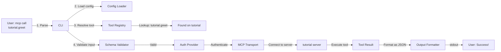

# Execute Your First Tool

In this tutorial, you'll execute an MCP tool for the first time. This takes **10 minutes**.

## Prerequisites

- Completed **[Your First Tool Discovery](first-discovery.md)** tutorial
- `mcpcli` installed and configured
- Test MCP server running (see previous tutorial)

## What You'll Learn

By the end of this tutorial, you'll:

- ✅ Execute a tool with JSON parameters
- ✅ Parse the JSON output
- ✅ Handle successful tool execution
- ✅ Understand tool naming conventions

## Part 1: List Available Tools (2 minutes)

First, refresh your memory of what tools are available:

```bash
$ mcp list
```

Look for tools in the `aggregated.tools` section. You should see:

- `tutorial.greet`
- `tutorial.add_numbers`

Note the **full name** including the server name: `tutorial.greet`

## Part 2: Execute the First Tool (3 minutes)

Let's execute the `greet` tool. The command format is:

```bash
mcp call <tool_name> '<json_input>'
```

Run:

```bash
$ mcp call tutorial.greet '{"name":"Alice"}'
```

You should see:

```json
{
  "success": true,
  "result": "Executed: greet",
  "toolName": "greet",
  "server": "tutorial"
}
```

**Congratulations!** You've executed your first tool. 🎉

## Part 3: Execute with Different Parameters (2 minutes)

Try the same tool with different input:

```bash
$ mcp call tutorial.greet '{"name":"Bob"}'
```

Then try:

```bash
$ mcp call tutorial.greet '{"name":"Charlie"}'
```

Each execution is independent—`mcpcli` connects fresh for each call.

## Part 4: Execute a Different Tool (2 minutes)

Try the `add_numbers` tool:

```bash
$ mcp call tutorial.add_numbers '{"a":5,"b":3}'
```

Output:

```json
{
  "success": true,
  "result": "Executed: add_numbers",
  "toolName": "add_numbers",
  "server": "tutorial"
}
```

## Part 5: Handle Errors Gracefully (1 minute)

Try executing with **invalid input**:

```bash
$ mcp call tutorial.add_numbers '{"a":"not a number","b":3}'
```

You'll see an error response:

```json
{
  "success": false,
  "error": {
    "type": "invalid_input",
    "message": "Invalid input for tool: add_numbers",
    "details": {
      "tool": "add_numbers",
      "server": "tutorial",
      "reason": "parameter validation failed"
    }
  }
}
```

This shows that `mcpcli` validates inputs before sending them to the server.

## Part 6: Use Verbose Mode (1 minute)

Add `--verbose` to see detailed debug information:

```bash
$ mcp call tutorial.greet '{"name":"Alice"}' --verbose
```

stderr output:

```
[2026-04-11T10:30:45.123Z] INFO: Executing tool: tutorial.greet
[2026-04-11T10:30:45.234Z] DEBUG: Connecting to server: tutorial
[2026-04-11T10:30:45.345Z] DEBUG: Validating input against tool schema...
[2026-04-11T10:30:45.456Z] DEBUG: Input validation passed
[2026-04-11T10:30:45.567Z] DEBUG: Executing tool...
[2026-04-11T10:30:45.678Z] DEBUG: Tool executed successfully
[2026-04-11T10:30:45.789Z] INFO: Execution complete
```

stdout output is still the JSON.

## Part 7: Understanding Tool Names (1 minute)

When you execute, always use the **full name**:

```
<server_name>.<tool_name>
```

For example:

- ✅ Correct: `mcp call tutorial.greet '{"name":"Alice"}'`
- ❌ Wrong: `mcp call greet '{"name":"Alice"}'` (missing server name)

If you forget the server name:

```bash
$ mcp call greet '{"name":"Alice"}'
```

You'll get:

```json
{
  "success": false,
  "error": {
    "type": "tool_not_found",
    "message": "Tool not found: greet",
    "details": { "requested": "greet", "available": ["tutorial.greet"] }
  }
}
```

The error message helpfully suggests the correct name!

## ✅ You Did It!

You've successfully:

- ✓ Executed a tool
- ✓ Passed JSON parameters
- ✓ Parsed the response
- ✓ Handled errors
- ✓ Understood tool naming
- ✓ Used verbose mode for debugging

## Tool Execution Flow

Here's what happens internally:



## What's Next?

- 👉 **[Set Up Multiple Servers](multi-server-setup.md)** — Execute tools from many servers
- 🔐 **[Add Authentication](../guides/auth-bearer.md)** — Secure your tools
- 📖 **[Full CLI Reference](../reference/cli-commands.md)** — All commands and options
- 🏗️ **[How mcpcli Works](../explanation/architecture.md)** — Learn the internals

## Troubleshooting

**"Tool not found"**

- Use the full name: `server_name.tool_name`
- Run `mcp list` to see available tools

**"Connection failed"**

- Ensure the test server is still running
- Use `--verbose` to see connection details

**"Invalid JSON input"**

- Validate your JSON at [jsonlint.com](https://jsonlint.com)
- Always quote the entire JSON string

**"Authentication failed"**

- Check your config file has correct auth settings
- See [Authentication Guide](../guides/auth-bearer.md)
