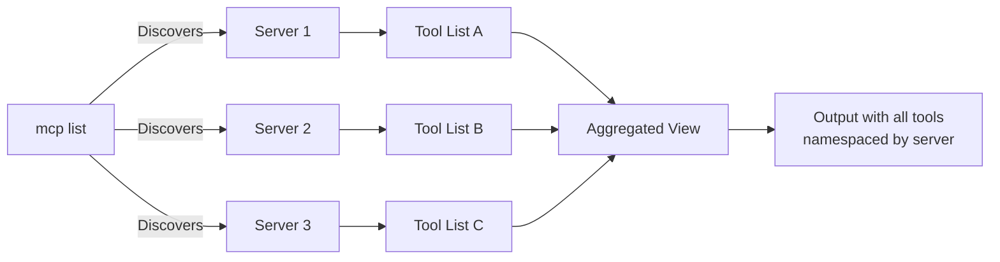

# Set Up Multiple MCP Servers

Configure `mcpcli` to work with multiple MCP servers simultaneously. This takes **15 minutes**.

## Prerequisites

- Completed **[Your First Tool Discovery](first-discovery.md)** tutorial
- Basic understanding of MCP servers and JSON configuration

## What You'll Learn

By the end of this tutorial, you'll:

- ✅ Configure multiple servers in one config file
- ✅ Discover tools across all servers
- ✅ Handle tool name conflicts with namespacing
- ✅ Use profiles to group servers for specific scenarios

## Part 1: Understand Multi-Server Architecture (3 minutes)

With multiple servers, `mcpcli` discovers tools from all of them and aggregates them:



The key benefit: **One command discovers all tools**.

## Part 2: Create Two Test Servers (5 minutes)

Create `server-files.js` (handles file operations):

```javascript
// server-files.js
const tools = [
  {
    name: "read_file",
    description: "Read file contents",
    inputSchema: {
      type: "object",
      properties: {
        path: { type: "string" },
      },
      required: ["path"],
    },
  },
  {
    name: "write_file",
    description: "Write file contents",
    inputSchema: {
      type: "object",
      properties: {
        path: { type: "string" },
        contents: { type: "string" },
      },
      required: ["path", "contents"],
    },
  },
];

async function handleMessage(message) {
  if (message.method === "initialize") {
    return {
      protocolVersion: "2024-11-05",
      capabilities: {},
      serverInfo: { name: "files", version: "1.0.0" },
    };
  }
  if (message.method === "tools/list") {
    return { tools };
  }
  if (message.method === "tools/call") {
    return { content: [{ type: "text", text: `Executed: ${message.params.name}` }] };
  }
  return { tools: [] };
}

const readline = require("readline");
const rl = readline.createInterface({ input: process.stdin, output: process.stdout });
let buffer = "";
rl.on("line", async (line) => {
  buffer += line;
  try {
    const message = JSON.parse(buffer);
    buffer = "";
    const response = await handleMessage(message);
    console.log(JSON.stringify(response));
  } catch (e) {}
});
```

Create `server-math.js` (handles math operations):

```javascript
// server-math.js
const tools = [
  {
    name: "add",
    description: "Add two numbers",
    inputSchema: {
      type: "object",
      properties: {
        a: { type: "number" },
        b: { type: "number" },
      },
      required: ["a", "b"],
    },
  },
  {
    name: "multiply",
    description: "Multiply two numbers",
    inputSchema: {
      type: "object",
      properties: {
        a: { type: "number" },
        b: { type: "number" },
      },
      required: ["a", "b"],
    },
  },
];

async function handleMessage(message) {
  if (message.method === "initialize") {
    return {
      protocolVersion: "2024-11-05",
      capabilities: {},
      serverInfo: { name: "math", version: "1.0.0" },
    };
  }
  if (message.method === "tools/list") {
    return { tools };
  }
  if (message.method === "tools/call") {
    return { content: [{ type: "text", text: `Executed: ${message.params.name}` }] };
  }
  return { tools: [] };
}

const readline = require("readline");
const rl = readline.createInterface({ input: process.stdin, output: process.stdout });
let buffer = "";
rl.on("line", async (line) => {
  buffer += line;
  try {
    const message = JSON.parse(buffer);
    buffer = "";
    const response = await handleMessage(message);
    console.log(JSON.stringify(response));
  } catch (e) {}
});
```

## Part 3: Update Configuration (3 minutes)

Update `~/.mcp/mcp.json` to include both servers:

```json
{
  "version": "1.0.0",
  "servers": [
    {
      "name": "files",
      "type": "stdio",
      "command": "node",
      "args": ["/full/path/to/server-files.js"],
      "timeout": 30000
    },
    {
      "name": "math",
      "type": "stdio",
      "command": "node",
      "args": ["/full/path/to/server-math.js"],
      "timeout": 30000
    }
  ]
}
```

## Part 4: Start Both Servers (2 minutes)

**Terminal 1:**

```bash
$ node server-files.js
```

**Terminal 2:**

```bash
$ node server-math.js
```

Keep both running. You'll use a **third terminal** for `mcpcli` commands.

## Part 5: Discover All Tools (2 minutes)

In a new terminal:

```bash
$ mcp list
```

Output shows tools from both servers:

```json
{
  "success": true,
  "servers": {
    "files": {
      "status": "connected",
      "tools": [
        { "name": "read_file", "description": "Read file contents" },
        { "name": "write_file", "description": "Write file contents" }
      ]
    },
    "math": {
      "status": "connected",
      "tools": [
        { "name": "add", "description": "Add two numbers" },
        { "name": "multiply", "description": "Multiply two numbers" }
      ]
    }
  },
  "aggregated": {
    "total": 4,
    "tools": [
      { "name": "files.read_file", "server": "files", "description": "Read file contents" },
      { "name": "files.write_file", "server": "files", "description": "Write file contents" },
      { "name": "math.add", "server": "math", "description": "Add two numbers" },
      { "name": "math.multiply", "server": "math", "description": "Multiply two numbers" }
    ]
  }
}
```

**See how namespacing works:**

- `files.read_file` — From the files server
- `math.add` — From the math server

## Part 6: Execute Tools Across Servers (2 minutes)

Execute a tool from the files server:

```bash
$ mcp call files.read_file '{"path":"/etc/hostname"}'
```

Now execute a tool from the math server:

```bash
$ mcp call math.add '{"a":10,"b":5}'
```

Notice: **All tools are accessed through the same `mcp` command**, but namespaced by server.

## Part 7: Handle Partial Failures (1 minute)

What if one server goes down? Stop one server, then run:

```bash
$ mcp list
```

Output:

```json
{
  "success": true,
  "servers": {
    "files": {
      "status": "failed",
      "error": "Server process exited"
    },
    "math": {
      "status": "connected",
      "tools": [...]
    }
  },
  "aggregated": {
    "total": 2,
    "tools": [
      { "name": "math.add", ... },
      { "name": "math.multiply", ... }
    ]
  }
}
```

**Key point:** `mcpcli` aggregates successfully, noting that one server failed. You can still use tools from the working server.

## Part 8: Add Profiles (3 minutes)

Update your config to add profiles for different scenarios:

```json
{
  "version": "1.0.0",
  "servers": [
    {
      "name": "files",
      "type": "stdio",
      "command": "node",
      "args": ["/full/path/to/server-files.js"]
    },
    {
      "name": "math",
      "type": "stdio",
      "command": "node",
      "args": ["/full/path/to/server-math.js"]
    }
  ],
  "profiles": {
    "default": {
      "servers": ["files", "math"]
    },
    "files-only": {
      "servers": ["files"]
    },
    "math-only": {
      "servers": ["math"]
    }
  }
}
```

Use a specific profile:

```bash
$ mcp list --profile=files-only
```

This only discovers tools from the files server.

Try math only:

```bash
$ mcp list --profile=math-only
```

## ✅ You Did It!

You've successfully:

- ✓ Configured multiple MCP servers
- ✓ Discovered tools from all servers in one command
- ✓ Used tool namespacing to prevent conflicts
- ✓ Called tools from different servers
- ✓ Handled partial failures gracefully
- ✓ Created profiles for different scenarios

## Key Concepts

| Concept                | Explanation                                     |
| ---------------------- | ----------------------------------------------- |
| **Aggregation**        | Tools from all servers combined into one list   |
| **Namespacing**        | Tools prefixed with server name (`server.tool`) |
| **Profiles**           | Groups of servers for specific scenarios        |
| **Partial failure**    | One server can fail; others still work          |
| **Parallel discovery** | All servers contacted simultaneously            |

## What's Next?

- 👉 **[Configuration Guide](../guides/configuration.md)** — Advanced config options
- 🔐 **[Add Authentication](../guides/auth-bearer.md)** — Secure your multi-server setup
- 📖 **[Tool Namespacing](../explanation/tool-namespacing.md)** — Deep dive into how namespacing works
- 🏗️ **[Architecture](../explanation/architecture.md)** — Understand how aggregation works internally

## Troubleshooting

**"Server connection failed"**

- Ensure both servers are running in separate terminals
- Check the command path in your config

**"Only some tools are showing"**

- Check which servers are connected with `mcp list`
- Restart any failed servers

**"Profile not found"**

- Verify the profile name in your config under `profiles`
- Default profile uses all servers if not specified
